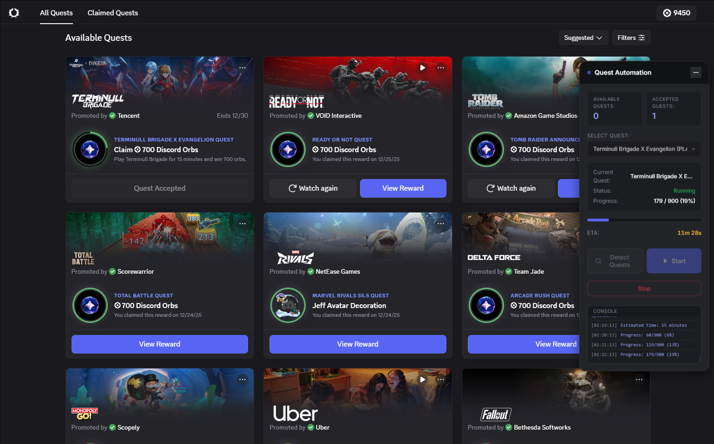

# Clear Orbs - Quest Automation

A desktop application for automating Discord Quest completion.

## Installation

1. Download the latest release from [Releases](https://github.com/YOUR_USERNAME/clear-orbs/releases)
2. Choose your preferred version:
   - **`Clear Orbs Setup 1.0.0.exe`** - Installer (recommended)
   - **`ClearOrbs-Portable.exe`** - Portable version (no installation needed)
3. Run the application and login to Discord

## Usage Guide

### 1. Play Game Quests (15 Minutes)

For quests that require playing a game for 15 minutes:

1. **Accept the quest** in Discord
2. **Select "Desktop"** as your platform
3. Go to the **Quest Automation panel**
4. Click **"Detect Quests"**
5. Select the quest from the dropdown
6. Click **"Start"**

> **Note:** There may be a delay in the automation's progress display - this is normal! As long as the progress is updating in Discord's quest page, everything is working correctly.

---

### 2. Watch Video Quests

For quests that require watching a video:

1. Click **"Start Watch"** on the video quest
2. **Close the video** immediately (no need to watch)
3. Go to the **Quest Automation panel**
4. Click **"Detect Quests"**
5. Select the video quest from the dropdown
6. Click **"Start"** and wait for completion

---

### 3. Watch Video on Mobile Quests

For quests that require watching on mobile (but you want to complete on Desktop):

1. Simply **Accept the quest** (no need to watch on mobile)
2. Go to the **Quest Automation panel**
3. Click **"Detect Quests"**
4. Select the quest from the dropdown
5. Click **"Start"** and wait for completion

---

### 4. Stream on Desktop Quests

For quests that require streaming:

1. **Accept the quest** in Discord
2. **Select "Desktop"** as your platform
3. Go to the **Quest Automation panel**
4. Click **"Detect Quests"**
5. Select the quest from the dropdown
6. Click **"Start"**

> **Note:** Same as Play Game quests - progress delay in automation is normal.

---

## Troubleshooting

- **Quest not detected?** Make sure you've accepted the quest first and selected a platform
- **Progress not updating?** Check if Discord's quest page shows progress - the automation delay is normal
- **Error messages?** Try refreshing Discord (Ctrl+R) and detect quests again

## Disclaimer

⚠️ **Use at your own risk.** This tool manipulates Discord's internal APIs and may violate Discord's Terms of Service.

---

